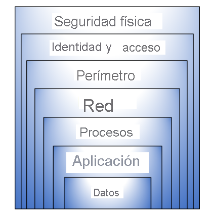
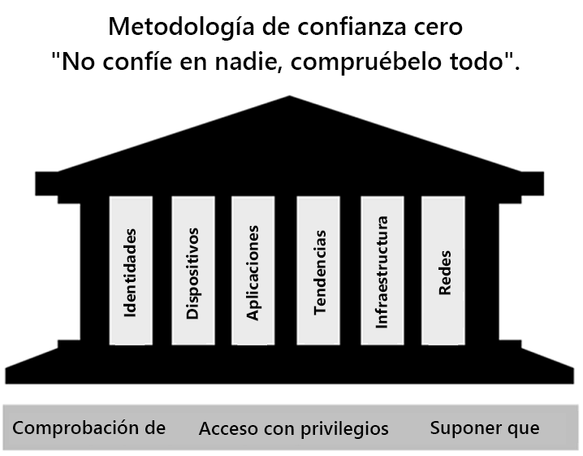
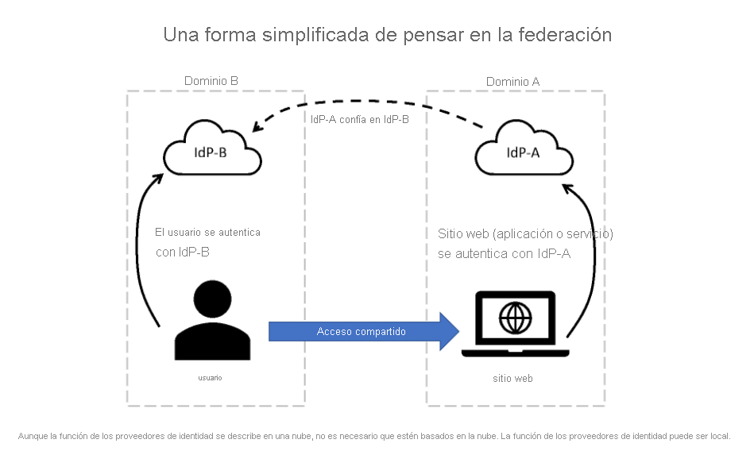
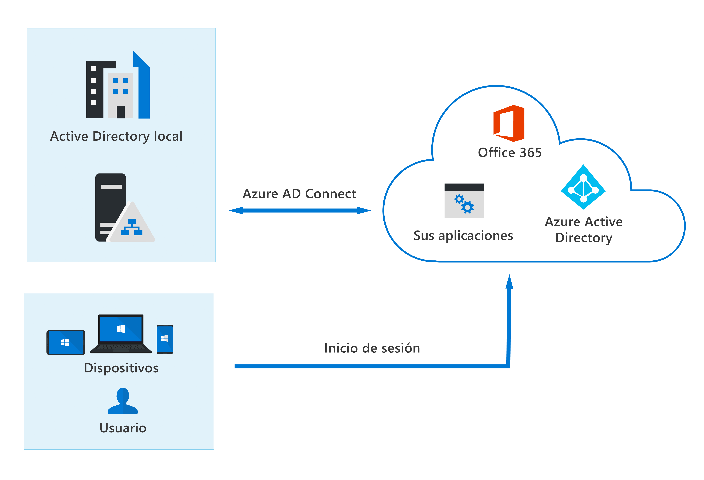

# **Microsoft Security Compliance and Identity Fundamentals**
## **Temario**
- [**Microsoft Security Compliance and Identity Fundamentals**](#microsoft-security-compliance-and-identity-fundamentals)
  - [**Temario**](#temario)
  - [**Descripción de conceptos de seguridad, cumplimiento e identidad**](#descripción-de-conceptos-de-seguridad-cumplimiento-e-identidad)
    - [**Seguridad y Cumplimiento**](#seguridad-y-cumplimiento)
      - [**Modelo de responsabilidad compartida**](#modelo-de-responsabilidad-compartida)
      - [**Defensa en profundidad**](#defensa-en-profundidad)
      - [**Confidencialidad, Integridad, Disponibilidad (CIA)**](#confidencialidad-integridad-disponibilidad-cia)
      - [**Modelo de Confianza Cero**](#modelo-de-confianza-cero)
      - [**Cifrado y código hash**](#cifrado-y-código-hash)
      - [**Cumplimiento**](#cumplimiento)
    - [**Identidad**](#identidad)
      - [**Rol del proveedor de identidades**](#rol-del-proveedor-de-identidades)
      - [**Federación**](#federación)
  - [**Descripción de funcionalidades de las soluciones para la administración de la identidad y el acceso de Microsoft**](#descripción-de-funcionalidades-de-las-soluciones-para-la-administración-de-la-identidad-y-el-acceso-de-microsoft)
    - [**Servicios y tipos de identidad de Azure AD**](#servicios-y-tipos-de-identidad-de-azure-ad)
    - [**Funcionalidades de autenticación de Azure AD**](#funcionalidades-de-autenticación-de-azure-ad)
      - [**Métodos de autenticación**](#métodos-de-autenticación)
      - [**MFA en Azure AD**](#mfa-en-azure-ad)
      - [**Autoservicio de reestablecimiento de contraseña (SSPR) con Azure AD**](#autoservicio-de-reestablecimiento-de-contraseña-sspr-con-azure-ad)
      - [**Funcionalidades de administración y protección de contraseñas de Azure AD**](#funcionalidades-de-administración-y-protección-de-contraseñas-de-azure-ad)
    - [**Funcionalidades de administración de acceso de Azure AD**](#funcionalidades-de-administración-de-acceso-de-azure-ad)
      - [**Acceso condicional de Azure AD**](#acceso-condicional-de-azure-ad)
      - [**Controles de acceso**](#controles-de-acceso)
      - [**Roles en Azure AD y control de acceso basado en roles**](#roles-en-azure-ad-y-control-de-acceso-basado-en-roles)
      - [**Categoría de roles de Azure AD**](#categoría-de-roles-de-azure-ad)
      - [**Diferencias entre RBAC de Azure AD y Azure**](#diferencias-entre-rbac-de-azure-ad-y-azure)
    - [**Funcionalidades de gobernanza y protección de identidades de Azure AD**](#funcionalidades-de-gobernanza-y-protección-de-identidades-de-azure-ad)
      - [**Gobernanza de identidades en Azure AD**](#gobernanza-de-identidades-en-azure-ad)
      - [**Administración de derechos y revisiones de acceso**](#administración-de-derechos-y-revisiones-de-acceso)
      - [**Condiciones de uso de Azure AD**](#condiciones-de-uso-de-azure-ad)
      - [**Privileged Identity Management (PIM)**](#privileged-identity-management-pim)
      - [**Azure Identity Protection**](#azure-identity-protection)
  - [**Descripción de las funcionalidades de las soluciones de seguridad de Microsoft**](#descripción-de-las-funcionalidades-de-las-soluciones-de-seguridad-de-microsoft)
    - [**Funcionalidades básicas de seguridad en Azure**](#funcionalidades-básicas-de-seguridad-en-azure)
      - [**Protección contra DDoS de Azure**](#protección-contra-ddos-de-azure)
      - [**Azure Firewall**](#azure-firewall)
      - [**Web Application Firewall**](#web-application-firewall)
      - [**Segmentación de red en Azure con Azure Virtual Network**](#segmentación-de-red-en-azure-con-azure-virtual-network)
      - [**Grupos de seguridad de red de Azure**](#grupos-de-seguridad-de-red-de-azure)
      - [**Diferencia entre Firewall y NSG**](#diferencia-entre-firewall-y-nsg)
      - [**Acceso JIT y Azure Bastion**](#acceso-jit-y-azure-bastion)
      - [**Cifrado de datos en Azure**](#cifrado-de-datos-en-azure)
    - [**Funcionalidades de administración de seguridad de Azure**](#funcionalidades-de-administración-de-seguridad-de-azure)
    - [**Funcionalidades de seguridad de Microsoft Sentinel**](#funcionalidades-de-seguridad-de-microsoft-sentinel)
    - [**Protección contra amenazas con Microsoft 365 Defender**](#protección-contra-amenazas-con-microsoft-365-defender)
  - [**Descripción de las funcionalidades de las soluciones de cumplimiento de Microsoft**](#descripción-de-las-funcionalidades-de-las-soluciones-de-cumplimiento-de-microsoft)
    - [**Capacidades de administración de cumplimiento en Microsoft**](#capacidades-de-administración-de-cumplimiento-en-microsoft)
      - [**Portal de confianza de Servicios**](#portal-de-confianza-de-servicios)
      - [**Principios de privacidad de Microsoft**](#principios-de-privacidad-de-microsoft)
    - [**Capacidades de administración de cumplimiento en Microsoft 365**](#capacidades-de-administración-de-cumplimiento-en-microsoft-365)
    - [**Características de protección y gobernanza de la información de Microsoft 365**](#características-de-protección-y-gobernanza-de-la-información-de-microsoft-365)
    - [**Capacidades de riesgo interno en Microsoft 365**](#capacidades-de-riesgo-interno-en-microsoft-365)
    - [**Funcionalidades de eDiscovery y de auditoría de Microsoft 365**](#funcionalidades-de-ediscovery-y-de-auditoría-de-microsoft-365)
    - [**Funcionalidades de la gobernanza de recursos en Azure**](#funcionalidades-de-la-gobernanza-de-recursos-en-azure)
      - [**Azure Policy**](#azure-policy)
      - [**Azure Blueprints**](#azure-blueprints)
      - [**Azure Purview**](#azure-purview)

## **Descripción de conceptos de seguridad, cumplimiento e identidad**
- Acceso a más datos
- Acceso externo
- Datos en red corporativa o en la nube
- Organizaciones deben cumplir requisitos normativos para la protección y privacidad
### **Seguridad y Cumplimiento**
#### **Modelo de responsabilidad compartida**
- Identifica que tareas de seguridad administra el **proveedor de la nube** y **el cliente**
- Varían según donde este la carga de trabajo: SaaS,PaaS,IaaS y Centro de datos local.

- **Centro de datos locales**: Desde seguridad física hasta cifrado de información.
- **Iaas**: Componentes de softwares (S.O, controles de red, aplicaciones y protección de los datos).
- **PaaS**: Aplicaciones y los datos.
- **SaaS**: Identidades y datos.

> Las responsabilidades que siempre tiene una organización:
> - Información y datos
> - Dipositivos(móviles y equipos)
> - Cuentas e identidades

#### **Defensa en profundidad**
- Estrategia de ciberseguridad
- Enfoque por capas para la seguridad
- Capa: Ralentizar el avance de un ataque por sus estructuras variadas

- **Seguridad física**: Acceso autorizado a un datacender
- **Identidad y acceso**: Seguridad como MFA o acceso basado en condiciones
- **Perímetro**: Protección frente a DDoS
- **Red**: Segmentación y controles de acceso a la red
- **Procesos**: Cómo protección del acceso a las VM´s ya sea de forma local o nube cerrando puertos
- **Aplicación**: Estén libres de vulnerabilidades de seguridad
- **Datos**: Administrar acceso a los datos y su cifrado

#### **Confidencialidad, Integridad, Disponibilidad (CIA)**
Se busca garantizar la **CIA** con estrategias de ciberseguridad.
- **Confidencialidad**: Conservar datos confidenciales cifrandolos, y las claves de cifrado también deben ser confidenciales.
- **Integridad**: Mantener los datos o mensajes correctos. Confianza de que los datos no se han alterado ni modificado.
- **Disponibilidad**: Datos a disposición de los usuarios cuando los necesiten.

#### **Modelo de Confianza Cero**
Principio: **"No confiar en nadie y comprobarlo todo".**  
En la práctica:
- Uso de MFA
- Acceso a usuarios específicos, 
- Limitar el tipo de dispositivo que puede ejecutar las aplicaciones  

**Principios de GUID de confianza cero (3 principios de Confianza Cero)**  
Guían y respaldan el modo de implementar la seguridad.  
- **Comprobación de forma explícita**: Autentica y autoriza siempre el contenido en función de la identidad de usuario,ubicación,dispositivo, servicio o carga de trabajo.
- **Acceso con privilegios mínimos**: Limita el acceso con "Just-in-Time" y "Just-Enough-Access(JIT/JEA)", directivas de adaptación basadas en riesgos y protección de datos.
- **Asunción de infracciones de seguridad**: Acceder al segmento mediante la red, usuario, dispositivo y aplicación. Usar cifrado y el análisis para detectar amenazas.
**Seis pilares básicos (elementos básicos)**
- **Identidades**: Usuarios, servicios o dispositivos.Seguir principio de *acceso con privilegios mínimos*
- **Dispositivos**: Son superficie de ataque. Se deben supervisar el estado y cumplimiento.
- **Aplicaciones**: Manera que se consumen datos. Detectar todas las aplicaciones que se usan (**Shadow IT**). Administrar permisos y accesos.
- **Datos**: Se clasifican, etiquetan y cifran. Garantizar que permanecen seguros cuando se mueven entre dispostivos, aplicaciones, infraestructura y redes.
- **Infraestructura**: Evaluar versión, configuración, acceso JIT y usar telemetría.
- **Redes**: Segmentación y microsegmentación. Protección contra amenazas en tiempo real, cifrado, supervisión, analísis de extremo a otro.

#### **Cifrado y código hash**
- Datos ilegibles e inútiles para visores no autorizados.
- Exige una clave secreta para descifrarlos.
- Cifrado de nivel superior simétrico: Misma clave para cifrar y descifrar
- Cifrado de nivel superior asimétrico: Clave pública y privada. (Cualquier llave cifra, pero juntas descifran)
- Protegen datos en reposo o en tránsito (Son mecanismos de seguridad).

**Cifrado de datos en uso**  
- Proteger datos en un almacenamiento no persistente
- RAM o caché de CPU
- Hecho con tecnologías que crean un enclave

#### **Cumplimiento**
- Privacidad y protección de datos son fundamentales.
- Los movimientos de datos a nubes implican ciertas consideraciones.
- Reglamentos, Responsabilidad con los datos:
  - **Residencia de datos**: Ubicaciones físicas de datos. Cómo y cuándo se transfieren,procesan o acceden a escala internacional.
  - **Soberanía de datos**: Datos sujetos a leyes y reglamentos del país donde se recopilan, conservan o procesan.
  - **Privacidad de los datos**: Transparencia sobre recopilación, procesamiento, uso compartido o no de los datos.
### **Identidad**
- Es el nuevo perímetro de seguridad
**Cuatro pilares de una infraestructura de identidad**  
- **Administración**: Creación,Goberanza de identidades y cómo y en qué situaciones se pueden editar estas.
- **Autenticación**: Cuanto necesita saber el sistema para saber que eres quién dice ser.
- **Autorización**: Datos de identidad entrantes para determinar nivel de acceso a un servicio o datos.
- **Auditoría**: Seguimiento de quién realiza qué, cuándo, dónde y cómo. Crear informes y alertas.
#### **Rol del proveedor de identidades**
- Autenticación moderna: métodos de AuthN y AuthZ entre cliente y servidor.
- En el centro de la autenticación moderna está **proveedor de identidades**
- Este crea,mantiene y administra identidades
- Da servicios de AuthN, AuthZ y auditoria.
- AHORA. **Proveedor de identidades central** brinda todos los servicios.
- Este centraliza la información para autenticar al usuario en servidor.
- Se pueden establecer directivas de AuthN y AuthZ
- Supervisar comportamiento de ususarios, actividades sospechosas y ataques
- Cliente -> Proveedor -> Token -> Cliente -> Token -> Servidor -> Token -> Proveedor
- **Microsoft Azure Active Directory** es un proveedor de identidades
- Un proveedor de identidades ofrece SSO (Inicio de sesión único)
#### **Federación**
- Acceso a servicios fuera de los límites del dominio con otro mediante relaciones de confianza entre sus proveedores de identidades
- No siempre es bidireccional

## **Descripción de funcionalidades de las soluciones para la administración de la identidad y el acceso de Microsoft**
### **Servicios y tipos de identidad de Azure AD**
- Solución de administración de identidad y acceso en nube y en entorno local
- Funciones de Active Directory
- Métodos de autenticación moderna
- Habilitar uso de dispositivos personales
- Colaboración con asociados comerciales
- Ofrece MFA y SSO
- Cuatro ediciones: Gratuitas, Office 365, Premium P1 y P2

**Tipos de identidad de Azure AD**  
- Usuarios: 
  - Se pueden agrupar con los mismos accesos
  - B2B permite compartir apps y servicios a usuarios invitados
- Entidades de servicio: Identidad de una aplicación
- Identidades administradas: Forma automática para conectarse a recursos de Azure
- Dispositivos: 
  - Registrados en Azure AD
  - Unido a Azure AD
  - Unidos a Azure AD Hibrido

**Tipos de identidades externas**  
Azure AD External Identites brinda capacidad de dar acceso a externos (estos "traen sus propias identidades")
  - Colaboración B2B (Usuarios entre negocios)
  - Administración de acceso B2C (Clientes a negocios, con cuenta de redes sociales, empresa o locales)

**Identidad híbrida (local y cloud)**
Todas requieren una instancia local de Active Directory
- Sincronización de hash de contraseña de Azure AD
- Autenticación transferida de Azure AD
- Autenticación federada

### **Funcionalidades de autenticación de Azure AD**
#### **Métodos de autenticación**
- **Contraseñas** 
- **Teléfono**:
  - Basada en SMS
  - Comprobación por llamada de voz
- **OATH (Open Authentication)**: Los tokens pueden ser de software o hardware
- Autenticación sin contraseñas:
  - Windows Hello (PIN y biometría)
  - Clave de seguridad FIDO2(Fast Identity Online): Clave de seguridad interna o integrada en dispositivo (USB,Bluetooth,NFC)
- Microsoft Authenticator: Convierte un teléfono en una credencial segura 

#### **MFA en Azure AD**
Solicita uno de los 3 tipos  
- **Algo que sabe**: Pass o PIN
- **Algo que tiene**:Dispositivo, Clave de hardware
- **Algo que forma parte de usted**:Biometría o rostro
Estas son las formas adicionales de verificación:
- Aplicación Microsoft Authenticator
- Windows Hello para empresas
- Clave FIDO2
- Token de hardware o software OATH
- SMS o llamada de voz

**Valores predeterminados de seguridad**: Conj. de mecanismos de seguridad de identidad básicos dados por Microsoft
- Aplicar registro MFA para los usuarios
- Forzar MFA a los administradores
- Requerir MFA a los usuarios en cualquier momento

#### **Autoservicio de reestablecimiento de contraseña (SSPR) con Azure AD**
- Cambiar o reestablecer su contraseña 
- Desbloquear cuenta
**Requiere**:
- Licencia de Azure AD
- Estar habilitados para SSPR por un admin
- Registrado con los métodos de autenticación que usarán
**Métodos**:
- Notificación o Código en app móvil
- Email o Teléfono
- Preguntas de seguridad 

#### **Funcionalidades de administración y protección de contraseñas de Azure AD**
- Evitar contraseñas no seguras
- Listas globales o personalizadas de contraseñas no aplicables (ambas se combinan)(Característica de Azure AD Premium P1,P2)

### **Funcionalidades de administración de acceso de Azure AD**
#### **Acceso condicional de Azure AD**
- Capa de seguridad adicional antes de dar acceso a los datos a usuarios
- Usa las directivas de acceso condicional creadas en Azure AD
- Esta analiza usuario, ubicación, dispositivo, aplicación, etc.
**Señales de acceso condicional** a tomar en cuenta por la directiva con lógica AND
- Pertenecer a un grupo o usuario
- Ubicación
- Dispositivo
- Aplicación
- Riesgo de inicio de sesión

#### **Controles de acceso**
Si se aplicó una directiva de acceso condicional...  
- Bloquear acceso
- Conceder acceso
- Requerir una o más condiciones antes de dar acceso
- Limitar a experiencias límitadas
> Estas directivas se pueden destinar a miembros invitados o de grupos

#### **Roles en Azure AD y control de acceso basado en roles**
- Roles de Azure AD controlan permisos de admin. de recursos en Azure AD.
- Roles integrados y personalizados
  - Integrados: admin *global*, *de usuarios* y *de facturación*
  - Personalizados: Colección de permisos seleccionados
    - Crear el rol, luego de seleccionar permisos
    - Asignar el rol a un grupo o usuario

#### **Categoría de roles de Azure AD**
- Específicos de Azure AD: Roles para admin. recursos solo de Azure AD.
- Específicos del servicio: Roles para admini. características de ese servicio (En Microsoft 365)
- Roles multiservicio: Roles que abarcan varios servicios.

#### **Diferencias entre RBAC de Azure AD y Azure**
- Azure AD: control de acceso a recursos de Azure AD como usuarios,grupos y aplicaciones
- Azure:control de acceso a recursos de Azure como VM´s

### **Funcionalidades de gobernanza y protección de identidades de Azure AD**
#### **Gobernanza de identidades en Azure AD**
- Administrar ciclo de vida de identidades de los usuarios y accesos
  - "Unirse,trasladar y abandonar"
  - Administra acceso a recursos
- Proteger el acceso con privilegios para la admin.
  - Son derechos administrativos, y deben ser gobernados para detectar uso incorrecto, dado por Azure AD Privileged Identity Management (PIM)(Azure AD P2).

#### **Administración de derechos y revisiones de acceso**
- Adm. de derechos: Adm. ciclo de vida de las identidades y acceso a escala (solicitudes,asignaciones de acceso y revisiones y expiración)
  - Usan delegación de creación de paquetes de acceso a usuarios
- Rev. de acceso: Adm. eficientemente la pertenencia a grupos,acceso a aplicaciones y asign. de roles.
  - Puede solicitar que los usuarios revisen su acceso o solo unos revisen el de todos
  - Los derechos de acceso no se cambian hasta que finalice revisión y pueden ser administrador por los admin que lo crearon.

#### **Condiciones de uso de Azure AD**
- Mostrar información antes que se obtenga acceso
- Términos de uso

#### **Privileged Identity Management (PIM)**
- Administra, controla, supervisa acceso a recursos(Azure AD,Microsoft 365, Intune).
- Mitiga permisos de acceso excesivos
**Características**
- Acceso con privilegios en Just-in-Time
- Asigna accesos durante intervalo de fechas
- Basado en aprobación
- Envia notificaciones cuando se activan los roles
- Auditable
- Reduce y permite supervisar los accesos en usuarios y que hacen con ellos

#### **Azure Identity Protection**
- Detección y correción de riesgos en identidad
- Exportar datos de detección de riesgos a terceros para analisis
- Señales analizadas pueden ser usadas por acceso condicional para tomar decisiones
- Las señales se cargan también en Microsoft Sentinel
- Califica el riesgo en bajo,medio y alto

"Riesgo de inicio de sesión" es un usuario que no ha autorizado una solicitud de autenticación. Usan
- Dirección IP anónima
- Viajes atípicos
- Dirección IP vinculada a malware
- Difusión de contraseña
- Inteligencia sobre amenazas de Azure AD

Este servicio solo genera detecciones de riesgos con credenciales correctas

## **Descripción de las funcionalidades de las soluciones de seguridad de Microsoft**
### **Funcionalidades básicas de seguridad en Azure**
- Aparecen amenazas de cualquier dirección: DDoS, Penetrar Firewall,etc.
- Azure ofrece herramientas de seguridad configurables
#### **Protección contra DDoS de Azure**
Dirigido a dispositivos de acceso público  
Tipos de ataques:
- Ataques volumétricos: inundan la red con tráfico
- Ataques de protocolo: agotar recursos con solicitudes de protocolo falso (gnral. nivel 3 y 4 en sus punton débiles)
- Ataques de nivel de recurso: dirigidos a paquetes de apli. webs y tratan de interrumpir transmisión entre hosts
**Azure DDoS Protection**
- Análisis de tráfico de red
- Es escalable y elástico de la red global
- Carga de red solo refleje el uso real de los clientes
- 2 niveles:
  - Básico: Automático,gratuito por propiedad de Azure
  - Estándar: Funciones adicionales adaptadas a Virtual Network usando directivas de protección 
#### **Azure Firewall**
- Seguridad de red enfocado a VNet de Azure
- Se puede usar en cualquier red virtual (centralizada recomendable)
- El tráfico sujeto a las reglas de firewall (como la puerta de enlace de una subred)
- Zonas de disponibilidad integradas
- Filtra a nivel de aplicación y de red
- SNAT  de salida y DNAT de entrada: traduce IP privada de los recursos de red a IP pública de Azure. Lo contrario igual
- Asociar varias IP públicas a Azure Firewall
- Inteligencia sobre amenazas
- Integración en Azure Monitor

#### **Web Application Firewall**
- Proteger aplicaciones web (procesos y puertos)
- Protección centralizada similar a Azure Firewall

#### **Segmentación de red en Azure con Azure Virtual Network**
- Dividir redes en más pequeñas
- Aislar recursos en su propia red
- Aplicar directivas de gobernanza a redes específicas
- La comunicación entre redes virtuales debe ser dada explicitamente

#### **Grupos de seguridad de red de Azure**
- Filtran tráfico de red hacia y desde los RECURSOS en una RED VIRTUAL
- Se pueden asociar a subred o interfaz de red en una VM
- Una red virtual de una VM solo puede tner un NSG, pero un NSG puede estar asociado a cuantas subredes e interfaces de red elija.
- Recordar las reglas de seguridad entrante y saliente

#### **Diferencia entre Firewall y NSG**
- Firewall complementa a NSG
- NSG filtra tráfico a los recursos DENTRO de las redes virtuales
- Firewall ofrece protección a nivel de red ENTRE las diferentes redes virtuales

#### **Acceso JIT y Azure Bastion**
- Cuando se tenga NSG y Firewall junto a sus recursos, se debe dar acceso directo a personas para trabajar de forma remota a los recursos  
- Generalmente RDP o SSH
**Azure Bastion**
- Azure Bastion permite conectarse a una VM mediante Azure Portal.
- Azure Bastion es un PaaS (se aprovisiona en las redes virtuales)
- Ofrece conectividad RDP y SSH mediante TLS
- Por medio de Bastio no se neceista de IP pública
- Se implementa Bastion por cada red virtual
- Abre la conexión RDP y SSH con la IP privada de la VM
- No requiere ningún NSG en una subred de Azure Bastion
**Acceso JIT**
- Cuando un usuario solicita acceso, Defender for Cloud comprueba su RBAC.
- Si se aprueba, se configura los NSG y Firewall para permitir tráfico entrante en los puertos seleccionados
- Cuando pase el tiempo, se restaura el NSG a su estado anterior (conexiones cerradas)
- Las conexiones establecidas no se interrumpen
> JIT requiere Microsoft Defender para servidores habilitado

#### **Cifrado de datos en Azure**
- Depende del servicio:
  - Azure Storage Service Encryption: Para Blob,Files,Queue
  - Azure Disk Encryption: Discos de VM´s con BitLocker y dm-crypt
  - Cifrado de datos transparente (TDE): Protege SQL Database y Data Warehouse

**Azure Key Vault**  
Almacena llaves y las centraliza proporcionando acceso seguro, control de permisos y registro de acceso.

### **Funcionalidades de administración de seguridad de Azure**
-- Luego

### **Funcionalidades de seguridad de Microsoft Sentinel**
Microsoft Sentinel es una solución SIEM/SOAR escalable
- Recopile datos
- Detecte amenazas
- Investigue amenazas
- Responda incidentes
**SIEM (Administración de eventos e información de seguridad)**  
- Recopilar datos de todo el patrimonio
- Realiza analiss y genera alertas e incidencias al encontrar correlaciones o anomalías
**SOAR (Respuesta automatizada de orquestación de seguridad)**  
- Recibe alertas de orígenes(como SIEM)
- Desecandena flujos de trabajo y procesos para mitigar el problema

**Sentinel y los datos - conexión**: Sentinel debe conectarse a los orígenes de seguridad(Microsoft 365,Office 365, Azure AD,etc).  
Ofrece conectores disponibles para Microsoft y otros que no lo son.  
- Workbooks: Luego de conectar,puede crear libros(de Azure Monitor) de todos los datos en informes visuales.
- Análisis: correlacionar alertas con incidentes
- Administración de incidentes en Microsoft Sentinel: Ciclo de vida del incidente
- Automatización y orquestación de seguridad: Se integra con Azure Logic Apps para los flujos de trabajo automatizados
- Investigación: Conocer ámbito de posible amenaza de seguridad y encontrar causa principal
- Búsqueda: Herramientas y consultas, basadas en MITRE para buscar amenazas de seguridad
- Notebooks: De Jupyter, para realizar análisis que no están en Sentinel como ML en Python, Visualizaciones, integrar datos, etc.
**Costos de Sentinel**
- Los datos se almacenan en Log Analytics de Azure Monitor
- Facturación basada en volumen de datos ingeridos y almacenados en Log Analytics
- Se paga por
  - Reservas de capacidad: Tarifa fija
  - Pago por uso: Factura por gigabyte
### **Protección contra amenazas con Microsoft 365 Defender**
- Defensa empresarial que coordina:
  - Detección
  - Prevención
  - Investigación
  - Respuesta
- Contra puntos de conexión(dispositivos),identidades,emails y aplicaciones
  - Identidades: Microsoft Defender for Identity y Azure AD Identity Protection
  - Puntos de conexión: Microsoft Defender para punto de conexión
  - Aplicaciones: Microsoft Defender for Cloud Apps
  - Email,URL y herramientas de colaboración: Microsoft Defender para Office 365
## **Descripción de las funcionalidades de las soluciones de cumplimiento de Microsoft**
### **Capacidades de administración de cumplimiento en Microsoft**
#### **Portal de confianza de Servicios**
- Información, Herramientas sobre seguridad,privacidad y cumplimiento de Microsoft.
#### **Principios de privacidad de Microsoft**

### **Capacidades de administración de cumplimiento en Microsoft 365**
### **Características de protección y gobernanza de la información de Microsoft 365**
### **Capacidades de riesgo interno en Microsoft 365**
### **Funcionalidades de eDiscovery y de auditoría de Microsoft 365**
### **Funcionalidades de la gobernanza de recursos en Azure**
#### **Azure Policy**
- Aplicar estándares y evaluar cumplimiento en toda organización
- Corrección masiva de recursos
- Correcció automática de nuevos recursos
- Implementación de la gobernanza para coherencia de los recursos
- Cumplir normativas, seguridad, costo y administración de recursos
- Policy evalua(contra las reglas de negocio) recursos de Azure y Arc(recursos especificos fuera de Azure)
- Reglas de negocio en formato JSON y son "definiciones de directivas"
- Varias reglas son "iniciativa de directiva"
- Policy evalua recursos en momento concretos del ciclo de vida de estos.
  - Crea,Elimina o Actualiza con asignación de directiva
  - Asignar directiva o iniciativa 
  - Actualiza directia o iniciativa
  - Cada 24 horas

**Diferencia de Policy con RBAC**
- Policy: Asegura que estado de recurso siga reglas de negocio
- RBAC: Administración de las acciones del usuario

#### **Azure Blueprints**
- Plantilla para repetir recursos de Azure
- Asi como asignación de roles,directiva, plantillas de ARM y grupos de recursos

#### **Azure Purview**
- Crear mapa holístico del panorama de sus datos, linaje de datos, clasificación de datos confidenciales.
- Automatiza detección de datos
- Mapa de datos
  - Detección y gobernanza. Captura metadatos 
- Data Catalog: Catalogo para busqueda de datos pertinentes
- Data Insights: Vista general de que datos se exploran,su ubicación y como se mueven.